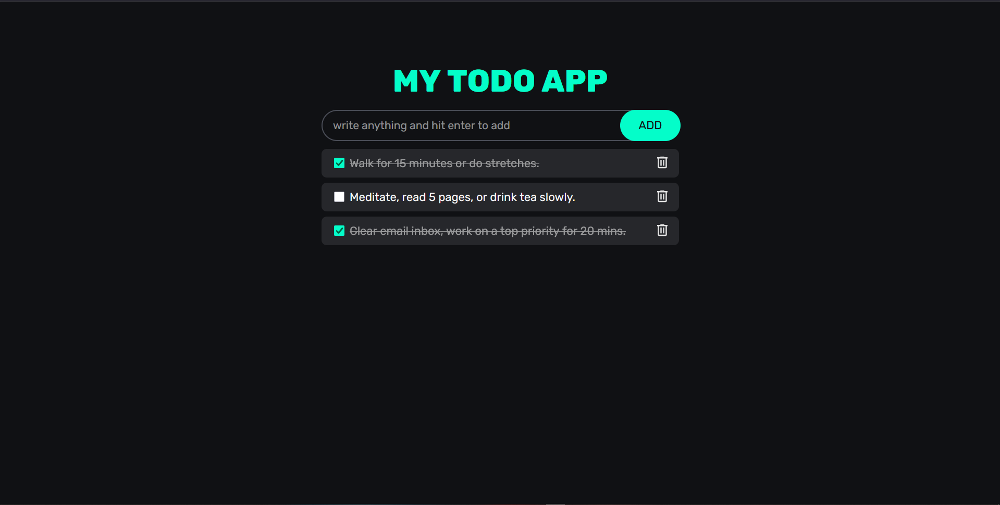

# 📝 TaskFlow - Todo App

TaskFlow is a simple and clean Todo App built using **HTML, CSS, and JavaScript**.
It helps users manage their daily tasks efficiently with a minimal and modern UI.

---

## 📸 Project Preview



---

## ✨ Features

* ➕ Add new tasks
* ✏️ Edit tasks (double click to edit)
* ✅ Mark tasks as completed
* 🗑️ Delete tasks
* ⚡ Instant UI updates

---

## 🛠️ Tech Stack

* HTML
* CSS
* JavaScript (Vanilla JS)

---

## 📂 Project Structure

```
taskflow-todo-app/
 ├── index.html
 ├── CSS/
 │   └── app.css
 ├── JS/
 │   └── script.js
 ├── project.png
```

---

## 🧠 What I Learned

* DOM Manipulation
* Event Delegation
* Handling user input
* Array methods (find, findIndex)
* Dynamic UI updates

---

## 🚧 Future Improvements

* 💾 Add LocalStorage (save data after refresh)
* ⌨️ Add Enter key support
* 📱 Improve responsiveness
* 🎨 Add animations

---

## 🙋‍♂️ Author

**Tafajjul**
Aspiring Web Developer 🚀

---

## ⭐ Support

If you like this project, consider giving it a ⭐ on GitHub!
